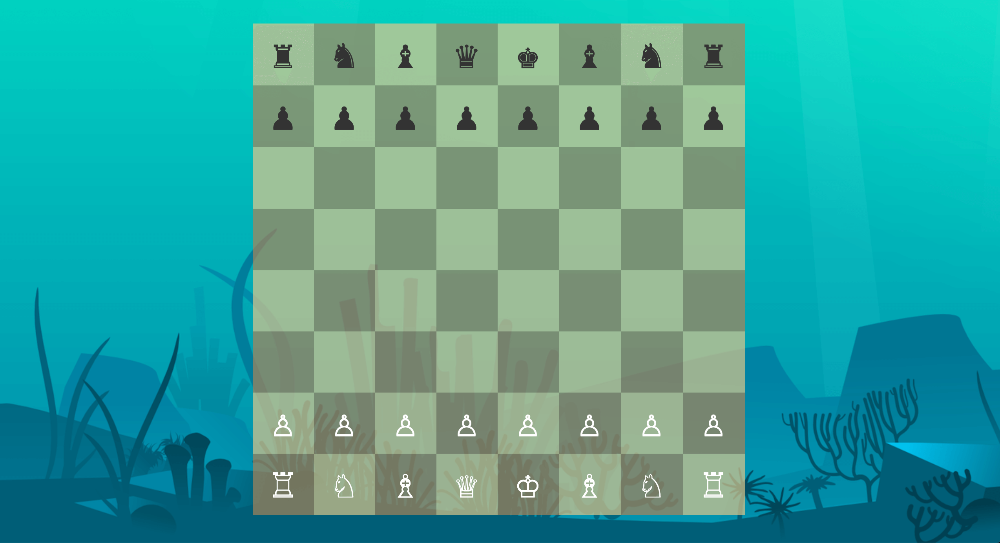

# Underwater Chess
The UI for Underwater Chess, written in React. See the [API](https://github.com/ncksllvn/chess-api).

## How to run
1. Copy `sample.env` to `.env`.
    - Optionally, update `REACT_APP_API` to point to your local API instance.
2. Run `npm install`
3. Run `npm start`
